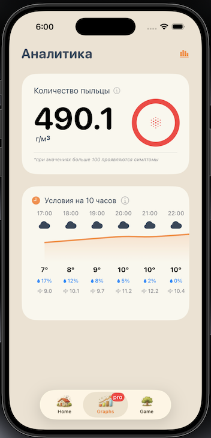

# Breathe

Приложение для **аллергиков на пыльцу** растений

В приложении работает на базе open-meteo




## Ответ сервера

### HomeView
```json
{{
    "activity": 2,
    "weather": {
        "temperature": 10.0,
        "wind_speed": 0.5,
        "icon": "cloud.rain.fill"
    },
    "allergens": [
        {
            "name": "Ольха",
            "value": 0,
            "img": "Ольха"
        },
        {
            "name": "Береза",
            "value": 2,
            "img": "Береза"
        },
        {
            "name": "Злаки",
            "value": 0,
            "img": "Злаки"
        },
        {
            "name": "Полынь",
            "value": 0,
            "img": "Полынь"
        },
        {
            "name": "Олива",
            "value": 0,
            "img": "Олива"
        },
        {
            "name": "Амброзия",
            "value": 0,
            "img": "Амброзия"
        }
    ]
}
```

### ProView
```json
{
    "activity": 0.2,
    "weatherHourly10": [
        10.2,
        9.2,
        10.2,
        10.2,
        10.1,
        10.2,
        10.0,
        10.0,
        9.8,
        9.6
    ],
    "weatherIconsHourly10": [
        "cloud.fill",
        "cloud.fill",
        "cloud.fill",
        "cloud.rain.fill",
        "cloud.rain.fill",
        "cloud.rain.fill",
        "cloud.rain.fill",
        "cloud.rain.fill",
        "cloud.fill",
        "cloud.fill"
    ],
    "precipitationProbabilityHourly10": [
        5,
        10,
        28,
        35,
        45,
        38,
        38,
        40,
        43,
        23
    ],
    "humidityHourly10": [
        71,
        76,
        74,
        77,
        79,
        82,
        86,
        88,
        89,
        87
    ],
    "windHourly10": [
        7.4,
        7.4,
        7.1,
        7.4,
        6.2,
        5.0,
        2.0,
        1.5,
        1.5,
        2.3
    ],
    "communityReports": {
        "count": 0,
        "avg": 0.0
    }
}
```
- текущее состояние активности
- список активности всех аллергенов