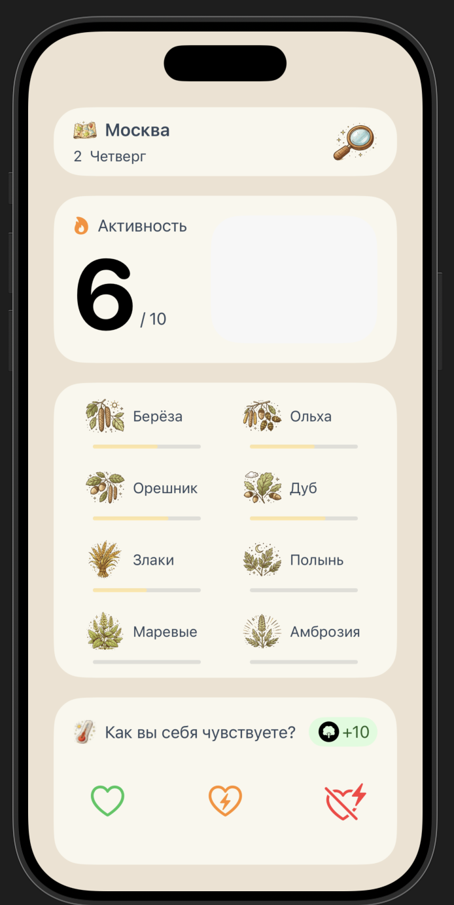

# Breathe

Приложение для **аллергиков на пыльцу** растений

В приложении собраны данные пользователей с polenclub о их самочувствии




## Ответ сервера

```json
{
  "activity": 8,
  "allergens": [
    { "name": "Береза", "value": 9 },
    { "name": "Орешник", "value": 3 },
    { "name": "Ольха", "value": 5 }
    ...
  ]
}
```
- текущее состояние активности
- список активности всех аллергенов